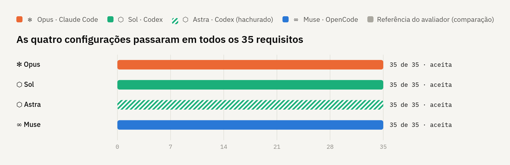
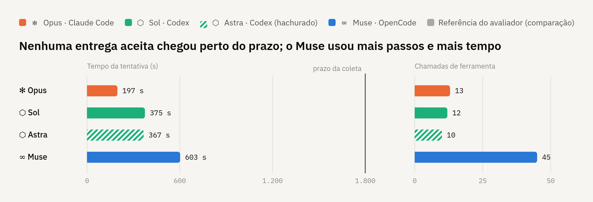
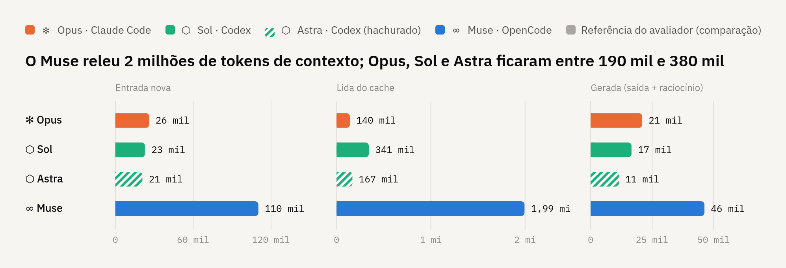
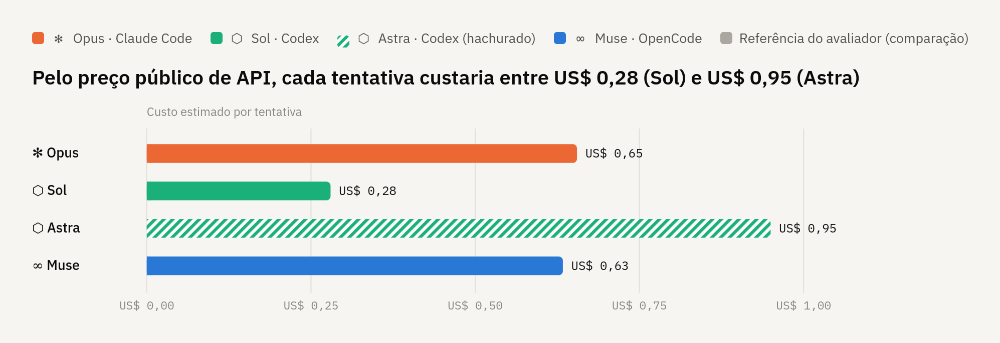
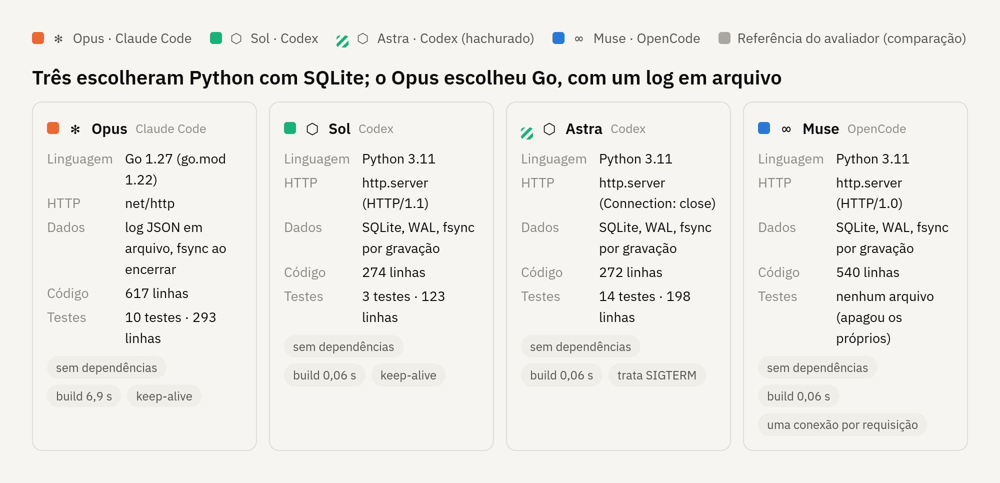
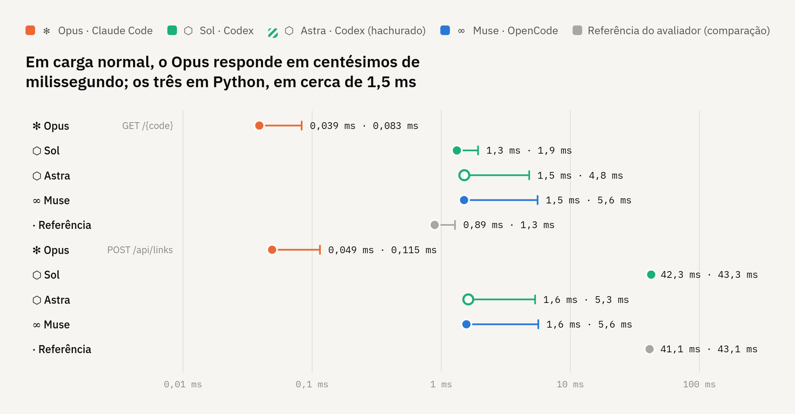
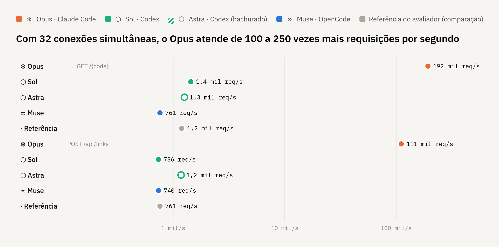
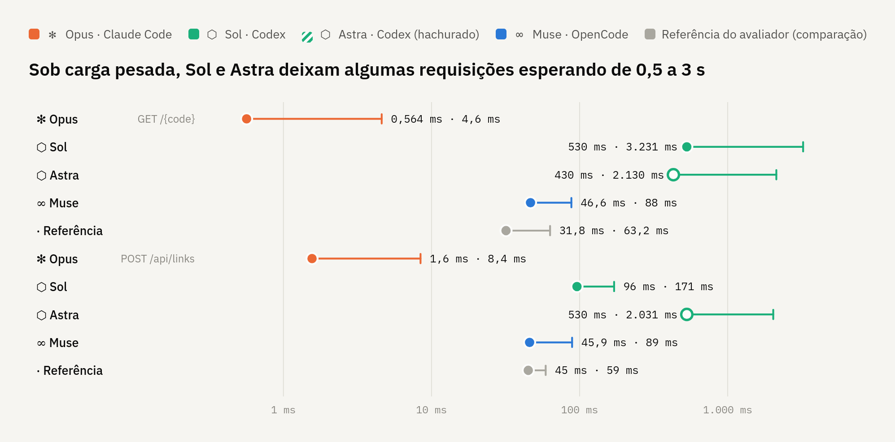

# Piloto com a tarefa real

Data: 24/09/2026. **Piloto concluído.** Registro das tentativas da tarefa do encurtador ([contrato](contrato-encurtador.md), Parte A) executadas com o [runner da coleta](../infra/attempt/README.md) e avaliadas pelo [avaliador](avaliador.md) 0.2.0. **Nenhuma tentativa é oficial nem entra na análise do benchmark.** Os resumos registram `official_collection: false` e `phase: "piloto"`.

Foram executados MiMo (duas vezes; a segunda a pedido de Rafael, com o runner corrigido), Muse, Opus, Sol (duas vezes) e Astra. **Rafael retirou o MiMo** depois das duas entregas vazias (§3.1), sem substituto. O Opus rodou depois da renovação da cota do plano Pro, com autorização explícita de Rafael. O Sol rodou depois da renovação da cota do ChatGPT, com autorização de Rafael. Na primeira tentativa, a entrega ficou vazia por falha da infraestrutura: faltava na imagem um binário do Codex (§4.7). Com a imagem corrigida e nova autorização de Rafael, a repetição teve a entrega aceita (§3.5). Depois, Rafael incluiu no piloto o Astra (`gpt-6-astra`, high, no Codex), que também teve a entrega aceita (§3.6), e decidiu incluí-lo na coleta oficial. **Os quatro participantes da coleta, Opus, Sol, Astra e Muse, tiveram uma entrega aceita no piloto.**

Rafael autorizou em 24/09/2026 enviar a Parte A do contrato às rotas gratuitas Muse e MiMo, sabendo que os dados podem ser usados para treino ([condições das rotas](../infra/pilot/README.md)). Só a Parte A foi enviada. A Parte B e os checks não saíram do computador.

## Resumo por pergunta da GQM

Um piloto por configuração; os números não são oficiais e não medem variação entre tentativas. Detalhes nas seções indicadas.

| Pergunta | O que o piloto mostrou |
|---|---|
| **Q1. Aceitação** | As quatro configurações da coleta tiveram `A_i = 1`, com 35 de 35 requisitos: Opus, Sol (na repetição), Astra e Muse. O MiMo teve 0 nas duas tentativas e foi retirado (§3.1). A primeira tentativa do Sol falhou por um defeito da imagem, não da entrega (§3.4) |
| **Q2. Requisitos** | Nenhum V nas entregas aceitas. Os únicos V são RNF01 (`build.sh` ausente) nas três entregas vazias, com os outros 34 requisitos em U |
| **Q3. Robustez** | Todos os requisitos de validação e erro (RN01–RN15) e de concorrência e durabilidade (RNF06–RNF09) com S nas quatro entregas aceitas |
| **Q4. Execução limpa** | As quatro compilaram e subiram sem intervenção: build de 0,06 s (Python) a 6,9 s (Go), prontidão em 0,07 s, SIGTERM em até 0,1 s |
| **Q5. Recursos** | Tempo de 197 s (Opus) a 602 s (Muse), no máximo 17% do prazo, sem intervenção humana. Tokens na §2.1: as semânticas dos harnesses diferem. Custo estimado pelo preço público de API (§2.1): Sol US$ 0,28, Muse US$ 0,63, Opus US$ 0,65 e Astra US$ 0,95 por tentativa. Não é o valor pago: a execução foi por assinatura ou rota gratuita |
| **Q6. Variação** | Sem dados: uma tentativa por configuração, por decisão de Rafael (§9) |
| **Q7. Qualidade interna** | A revisão qualitativa (M12) não foi feita no piloto. Para ela: testes automatizados no Astra (14), no Opus (10) e no Sol (3); o Muse apagou os próprios testes |
| **Q8. Stack** | Três em Python com biblioteca padrão e SQLite (Muse, Sol e Astra, de 272 a 540 linhas) e uma em Go com biblioteca padrão e log em arquivo (Opus, 617 linhas). Nenhuma dependência externa |
| **Q9. Tempo de resposta** | Com `DATA_DIR` em disco (§8.1): o Opus responde em cerca de 0,05 ms e aguenta de 110 mil a 190 mil req/s. As entregas em Python ficam entre 1,3 e 1,6 ms e aguentam de 740 a 1.440 req/s, exceto o POST do Sol, em 42 ms por causa da camada HTTP. Sob saturação, Sol e Astra têm picos de 0,4 a 3 s |

### Gráficos

Gerados a partir de `summary.json` e dos resultados da latência 0.2, com a mediana de três medições. A cor identifica a família do modelo: laranja para Claude (✻), verde-água para GPT (⬡) e azul para Muse (∞). O Astra aparece hachurado ou com ponto vazado, para se distinguir do Sol. Os gráficos mostram só as quatro entregas aceitas; as tentativas descartadas (MiMo e a 1ª do Sol) estão nas §2 e §3. Nos gráficos de latência, a referência do avaliador aparece em cinza, só como comparação. Os símbolos são marcadores genéricos, não logotipos. Versão interativa, com os valores ao passar o mouse, no artifact do piloto.

**Q1 e Q2.** Requisitos satisfeitos por entrega aceita: 35 de 35, sem nenhum V ou U.

**Q5.** Tempo de trabalho do agente, com a linha do prazo da coleta, e número de chamadas de ferramenta.

**Q5, tokens.** Normalizados entre harnesses (§2.1): entrada nova, que inclui a escrita de cache; entrada lida do cache; e tokens gerados, com saída e raciocínio. Cada painel tem sua escala.

**Q5, custo estimado (M9).** Tokens vezes o preço público de API de cada modelo (§2.1). Não é o valor pago.

**Q8.** Stack de cada entrega aceita.

**Q9, carga normal.** 500 req/s por 30 s, com `DATA_DIR` em disco. O ponto é o p50 e a ponta da linha, o p99. Escala logarítmica.

**Q9, capacidade.** Vazão com 32 conexões simultâneas. O Opus atingiu o teto de 300 mil requisições, então o valor dele é um limite inferior. Escala logarítmica.

**Q9, cauda sob saturação.** Com 32 conexões simultâneas, o ponto é o p99 e a ponta da linha, o máximo. Escala logarítmica.

## 1. Configuração comum

| Item | Valor observado |
|---|---|
| Imagem | `llm-bench-runtime:20260924`: ID `sha256:aa1c6322f54a…39eb` nas cinco primeiras tentativas e avaliações, preservada como `llm-bench-runtime:20260924-v1-sem-code-mode-host`; ID `sha256:838a7837a0ec…01c6` na repetição do Sol e no Astra, que difere só pelo `codex-code-mode-host` (§4.7). Depois do piloto, a imagem foi reconstruída a partir dos binários fixos, com o mesmo conteúdo e o ID `sha256:f5e1796e3908…` (§9) |
| Harness | OpenCode 1.18.32 (MiMo e Muse); Claude Code 2.1.281 (Opus); Codex 0.156.1 (Sol e Astra) |
| Configuração do runner | `infra/attempt/config.json`, SHA-256 `15781e13…908e` nas três. O código do runner mudou antes da repetição do MiMo (§4.1 e §4.2), sem alterar configuração, prompt, rede ou recursos; o resumo não registra o hash do script. Depois das três, a entrada `mimo` foi removida da configuração. As tentativas de Opus e Sol usaram a configuração nova, `1d77eac4…`, que difere só pela remoção. O Astra usou a configuração com a entrada `astra` acrescentada, e o runner passou a escolher credencial e extrator de consumo pelo harness, e não pelo nome do participante |
| Prompt | Preâmbulo + Parte A; contrato `21d9aa5a…91c7`, Parte A `f2dfdada…2910`, prompt `5ae1536c…c147`. Único placeholder: prazo de prontidão = 60 s |
| Prazo por tentativa | 3600 s, com 10 s de tolerância, em todas as tentativas do piloto. Para a coleta, Rafael decidiu 1800 s (§9) |
| Recursos | 4 GiB, 2 CPUs, 512 processos; tmpfs com home de 2 GiB e `/tmp` e workspace de 1 GiB (provisório) |
| Skills | Nenhuma |
| Avaliador | 0.2.0, parâmetros provisórios de `evaluator/config.json` (prontidão 60 s, expiração 4 s, n/m/p = 50/20/50) |

Nas sete tentativas, a preparação confirmou home e workspace vazios, UID 1001, ausência do home do host e do socket Docker. A rede confirmou `pypi.org` alcançável, `example.com` bloqueado pelo proxy e saída direta a IP bloqueada. MiMo e Muse não receberam credencial, porque as rotas gratuitas não usam. O Opus recebeu só a própria credencial do Claude Code, e Sol e Astra só a do Codex (`.codex/auth.json`), da mesma conta. `contains_credentials` ficou `false` nas sete.

## 2. Tentativas executadas

Executadas uma de cada vez, na ordem: MiMo, Muse, repetição do MiMo (depois das correções do runner), Opus, Sol, repetição do Sol (depois da correção da imagem) e Astra. Horários em UTC. "Tarefa" é o `docker exec` do harness; "total" inclui preparação, congelamento, limpeza e avaliação.

| Tentativa | Participante | Prazo | Saída | Tarefa (s) | Total (s) | Entrega | A_i | S/V/U |
|---|---|---|---|---|---|---|---|---|
| `20260924T173254Z-mimo-1c9c89` | MiMo, `opencode/mimo-v2.6-flash-free`, sem variante | 3600 s | 0 | 254,5 | 257,0 | **vazia**: 0 entradas | **0** | 0 / 1 / 34 |
| `20260924T173758Z-muse-f55ab6` | Muse, `opencode/muse-spark-1.3-contributor-free`, xhigh | 3600 s | 0 | 602,5 | 611,5 | 4 arquivos, tar de 30 KiB | **1** | 35 / 0 / 0 |
| `20260924T180503Z-mimo-393380` | MiMo, repetição com o runner corrigido | 3600 s | 0 | 958,1 | 960,3 | **vazia**: 0 arquivos | **0** | 0 / 1 / 34 |
| `20260924T184717Z-opus-474850` | Opus, `claude-opus-5-5`, high | 3600 s | 0 | 196,7 | 212,0 | 9 arquivos, tar de 40 KiB | **1** | 35 / 0 / 0 |
| `20260924T192934Z-sol-9d4b81` | Sol, `gpt-6-sol`, high | 3600 s | 0 | 60,6 | 62,3 | **vazia**: 0 arquivos, **falha da infraestrutura** (§4.7) | 0 | 0 / 1 / 34 |
| `20260924T193701Z-sol-94fff0` | Sol, repetição com a imagem corrigida | 3600 s | 0 | 374,5 | 382,7 | 5 arquivos, tar de 30 KiB | **1** | 35 / 0 / 0 |
| `20260924T200205Z-astra-baba70` | Astra, `gpt-6-astra`, high | 3600 s | 0 | 366,6 | 375,0 | 6 arquivos, tar de 40 KiB | **1** | 35 / 0 / 0 |

Nas sete tentativas:

- `timed_out: false`, nenhum processo remanescente antes do congelamento e `errors: []` no resumo.
- Destinos no proxy de Sol e Astra, nas três tentativas do Codex: `ALLOW chatgpt.com` e `pypi.org` (verificação do runner). O proxy bloqueou `ab.chatgpt.com` e dois hosts `*.oaiusercontent.com`, sem efeito visível nas tentativas (§4.7).
- Destinos no proxy do Opus: `ALLOW api.anthropic.com` e `pypi.org` (verificação de rede do runner); nenhum download do agente. Destinos no proxy de MiMo e Muse: `ALLOW` só para `opencode.ai`, `models.opencode.ai`, `registry.npmjs.org` (dependências do próprio OpenCode) e `pypi.org` (verificação de rede do runner). O único `DENY` é `example.com:443`, da verificação de rede do runner. O agente não tentou nenhum destino bloqueado. Na repetição do MiMo houve um `CONNECT_FAILED registry.npmjs.org` entre 27 `ALLOW`, numa conexão do próprio OpenCode ao baixar dependências; não afetou a tentativa.
- A limpeza da tentativa e da avaliação retornou 0 em todos os containers e redes, sem sobras.
- Nas duas primeiras, `session_exported: false` e `reported_models: []`: o modelo servido não ficou registrado (§4.1). Na repetição do MiMo, com o runner corrigido, a sessão foi exportada (142.965 bytes, acima do limite de 128 KiB que truncava o método antigo) e o harness informou `mimo-v2.6-flash-free`, variante `default`. No Opus, o harness informou `claude-opus-5-5`; `harness_init` confirmou as ferramentas pedidas, sem `tools_mismatch` (§4.6).

### 2.1 Consumo informado pelo harness (M14)

No OpenCode, soma dos eventos `step_finish`, com `input_includes_cache` ainda `null` (não verificado). No Claude Code, último evento `result`, com a entrada sem o cache e o raciocínio de `modelUsage.thinkingTokens`. No Codex, soma dos eventos `turn.completed`: a entrada inclui o cache (`input_includes_cache: true`), e o raciocínio (`reasoning_output_tokens`) é parte da saída. As semânticas diferem, então as linhas não são diretamente comparáveis (GQM §6). Custo informado 0 nas duas rotas gratuitas; a estimativa de M9 fica ausente, não zero, como no [piloto de infraestrutura](piloto-infraestrutura.md) §5. O custo do Opus é a estimativa do próprio Claude Code: o login é por assinatura, e o valor não foi cobrado.

| Tentativa | Passos | Entrada | Saída | Raciocínio | Cache lido | Cache escrito | Custo informado |
|---|---|---|---|---|---|---|---|
| MiMo | 2 | 6.334 | 121 | 32.019 | 9.664 | 0 | US$ 0 |
| Muse | 45 | 110.239 | 19.435 | 26.845 | 1.993.693 | 0 | US$ 0 |
| MiMo (repetição) | 2 | 557 | 103 | 32.010 | 15.232 | 0 | US$ 0 |
| Opus | 14 turnos | 16 | 20.944 | 3.202 | 140.326 | 25.995 | US$ 0,65 (estimativa do harness) |
| Sol (1ª, sem ferramenta) | 1 turno | 159.246 (inclui cache) | 800 | 369 (dentro da saída) | 148.608 | — | não informado |
| Sol (repetição) | 1 turno | 364.012 (inclui cache) | 16.607 | 8.188 (dentro da saída) | 341.248 | — | não informado |
| Astra | 1 turno | 188.131 (inclui cache) | 11.484 | 1.966 (dentro da saída) | 167.296 | — | não informado |

### 2.2 Tokens normalizados e custo estimado (M9)

Para comparar os harnesses, os tokens de cada entrega aceita foram normalizados em três categorias:

- **Entrada nova:** o que o modelo leu pela primeira vez.
  - Claude Code: `input_tokens` mais os escritos no cache.
  - Codex: entrada menos o cache.
  - OpenCode: `input`, que não inclui o cache. O cache lido (1,99 milhão) é maior que a entrada (110 mil), então não pode estar contido nela.
- **Lida do cache:** o contexto relido a cada passo.
- **Gerada:** saída mais raciocínio.
  - Claude Code e Codex: `output_tokens`, que já inclui o raciocínio.
  - OpenCode: `output` + `reasoning`.

A estimativa de M9 aplica a cada categoria o preço público de API do modelo solicitado, conforme a GQM (§6). Preços consultados em 24/09/2026, em US$ por milhão de tokens:

| Modelo | Entrada | Cache lido | Escrita de cache | Saída | Fonte |
|---|---|---|---|---|---|
| `claude-opus-5-5` | 4,00 | 0,20 | 8,00 (TTL de 1 h; 2× a entrada) | 20,00 | Referência da API da Anthropic (tabela de modelos, cache de 24/06/2026; multiplicadores de cache) |
| `gpt-6-sol` (contexto curto, ≤ 272 mil) | 2,00 | 0,20 | 2,50 | 10,00 | developers.openai.com/api/docs/pricing; igual no OpenCode Zen |
| `gpt-6-astra` (contexto curto, ≤ 272 mil) | 10,00 | 1,00 | 12,50 | 50,00 | developers.openai.com/api/docs/pricing; igual no OpenCode Zen |
| Muse Spark 1.3 (rota paga) | 1,25 | 0,15 | não listado | 4,25 | opencode.ai/docs/zen |

| Entrega | Entrada nova | Cache lido | Gerada | Custo estimado |
|---|---|---|---|---|
| Opus | 26.011 (16 + 25.995 escritos) | 140.326 | 20.944 (~3.202 de raciocínio) | **US$ 0,655** |
| Sol | 22.764 | 341.248 | 16.607 (8.188 de raciocínio) | **US$ 0,280** |
| Astra | 20.835 | 167.296 | 11.484 (1.966 de raciocínio) | **US$ 0,950** |
| Muse | 110.239 | 1.993.693 | 46.280 (26.845 de raciocínio) | **US$ 0,634** |

**Ressalvas:**

- **Validação cruzada no Opus:** com escrita de cache de 1 hora e a saída incluindo o raciocínio, a estimativa dá US$ 0,65497, idêntica ao custo que o Claude Code informou. Isso confirma a interpretação dos campos do Claude Code.
- **Faixa de contexto:** Sol e Astra foram estimados na faixa de contexto curto, supondo que nenhuma requisição passou de 272 mil tokens. A entrada total das tentativas (364 mil e 188 mil) soma vários turnos.
- **Raciocínio do Muse:** foi cobrado como saída, como é usual.
- **Muse:** a rota usada foi a gratuita. A estimativa usa o preço do Muse Spark 1.3 pago, que é outro identificador. Pela regra da GQM, o valor responde "quanto custaria na rota paga", não o custo da rota usada.
- **Valor pago:** nenhuma das tentativas foi paga por token. Opus rodou por assinatura do Claude, Sol e Astra por assinatura do ChatGPT, e Muse pela rota gratuita.

## 3. Resultados e diagnóstico

### 3.1 MiMo: entrega vazia nas duas tentativas

**V: RNF01.** `./build.sh` terminou com código 127 (`No such file or directory`). O `delivery.tar` tem só a entrada `./`, e o hash da árvore é o SHA-256 da entrada vazia (`e3b0c442…b855`). Os outros 34 requisitos ficaram **U** pela pré-condição do build, conforme a regra do avaliador (§3). **Diagnóstico: falha real da entrega.** O avaliador está correto: não havia `build.sh`.

Causa, pelo `stdout.jsonl`:

1. **Primeiro passo (+3 s):** duas chamadas `bash` de reconhecimento (versões das ferramentas e variáveis de ambiente), terminado com `reason: tool-calls`.
2. **Segundo passo:** durou cerca de 249 s e terminou com **`reason: length`**, com 32.005 tokens de raciocínio e **0 de saída**. É o teto de saída de 32 mil tokens do modelo no catálogo. O modelo consumiu o limite inteiro raciocinando antes de emitir qualquer chamada de ferramenta.
3. **Fim:** o `opencode run` encerrou com código 0 depois desse passo, sem continuar e sem escrever arquivo algum.

Classificação: o provedor respondeu e a infraestrutura funcionou (rede, runner, congelamento, avaliação e limpeza). Não é falha operacional da infraestrutura. É um resultado observado da configuração participante: um passo de raciocínio do modelo esbarrou no limite de saída, e o harness trata `length` como término. A GQM (§4) manda registrar entrega vazia como resultado observado, e não como exclusão automática. Se esse caso conta como falha da entrega ou como problema operacional do harness/provedor (§6) é decisão do protocolo. A primeira tentativa não foi repetida automaticamente. Rafael pediu a repetição depois das correções do runner.

**Repetição (`20260924T180503Z-mimo-393380`).** Mesmo prompt (`5ae1536c…`), configuração e imagem. O resultado foi idêntico: RNF01 V pela ausência de `build.sh` e 34 U. O runner corrigido registrou os dois avisos novos: entrega sem arquivos e término por limite de saída (`harness_end.last_reason: length`).

- **Primeiro passo:** duas chamadas `bash` de reconhecimento em menos de 2 s.
- **Segundo passo:** começou aos +29 s e terminou aos +931 s, com `reason: length`, 32.001 tokens de raciocínio e 0 de saída. Mesmo número de tokens da primeira tentativa, em cerca de 3,6 vezes o tempo; a vazão do provedor variou.
- A sessão exportada confirma: o modelo `mimo-v2.6-flash-free`, provedor `opencode`, `finish: length`, sem `error`, e um único bloco de raciocínio de 122.603 caracteres, sem nenhuma parte `tool` no segundo passo.

**O que o modelo fez no raciocínio.** Contagem sobre o texto da sessão, tratado como dado:

- O raciocínio começa decidindo pela stack: Python com a biblioteca padrão, `ThreadingHTTPServer` e SQLite, a mesma do Muse.
- Em seguida, escreve a implementação dentro do próprio raciocínio: 178 delimitadores de bloco de código, 96 `def`, 35 `class` e trechos repetidos, como o `CREATE TABLE`, sinal de versões sucessivas.
- Revisa detalhes sem parar: 55 "Hmm", 45 "Actually" e 19 "Wait".
- O limite o interrompe numa dúvida sobre `server_close` e `block_on_close` do `ThreadingHTTPServer`, sem ter chamado a ferramenta de escrita.

**Leitura.** Em duas de duas tentativas, o MiMo tentou resolver a tarefa inteira num único passo de raciocínio, em vez de escrever arquivos e iterar com as ferramentas, e esgotou o teto de 32 mil tokens de saída. Não é falta de contexto: o passo usou cerca de 8 mil tokens de entrada, e a janela é de 200 mil. Também não é falta de tempo: a tentativa usou 7% e 27% do prazo. Com o catálogo sem variantes de esforço, a configuração atual não oferece como limitar esse raciocínio. Duas tentativas não medem a frequência, mas indicam que o padrão não é ocasional.

### 3.2 Muse: 35 S

**Sem V nem U.** `A_i = 1`, M3 = 35/35. RN13 conferiu 55 respostas de erro, o mesmo número da referência. RNF06 contou 50 visitas simultâneas. Não houve erro interno do avaliador.

Entrega e stack (M15):

- **Arquivos:** `README.md`, `build.sh`, `start.sh` e `server.py` (cerca de 20 KB).
- **Stack:** Python 3.11 só com a biblioteca padrão: `ThreadingHTTPServer`, SQLite em `DATA_DIR/links.db` com WAL e `synchronous=FULL`, e um `threading.Lock` global. É a mesma stack da referência do avaliador.
- **Dependências:** nenhuma. Sem manifestos nem lockfiles (`has_lock: false`, `manifests: []`). O lock não se aplica.
- **`build.sh`:** só `python3 -m py_compile server.py`. **`start.sh`:** usa `exec python3 server.py`.

Diagnóstico da avaliação:

| Item | Valor |
|---|---|
| Build | código 0 em 0,06 s, sem destinos no proxy |
| Prontidão (RNF02) | 0,07 s nos três inícios |
| SIGTERM (RNF10, diagnóstico) | processo e grupo encerrados em 0,05 s nos três inícios |
| Arquivos alterados fora de `DATA_DIR` | 0 |
| Isolamento | três sondas bloqueadas |
| Avaliação | 7,5 s |

Linha do tempo do agente, contada do início da tarefa:

- **+116 s:** primeira chamada de ferramenta.
- **+238 s:** primeiro arquivo escrito (`server.py`).
- **+255 s:** entrega completa pela primeira vez, com os quatro arquivos; o build passa aos +259 s.
- **+259 s a +567 s:** testes locais, três correções no parser de RFC 3339 e remoção dos scripts de teste e dados temporários.
- **+603 s:** mensagem final. Usou cerca de 17% do prazo.

Para a revisão qualitativa, não para a aceitação: os scripts de teste `run_tests.py`, `run_tests2.py` e `finalcheck_script.py` foram apagados antes do fim. A seção "Testes automatizados" do README traz só um script para colar no terminal, com o servidor rodando.

### 3.3 Opus: 35 S

**Sem V nem U.** `A_i = 1`, M3 = 35/35, sem erro interno do avaliador. É a primeira entrega fora de Python: exercita o build e a partida de uma stack diferente da referência.

Entrega e stack (M15):

- **Arquivos:** `go.mod`, `main.go`, `handlers.go`, `store.go`, `server_test.go` (10 testes), `build.sh`, `start.sh`, `README.md` e `.gitignore` (`bin/`, `data/`, `.gocache/`). O binário e o cache foram apagados antes do fim; a entrega é só código-fonte.
- **Stack:** Go (`go 1.22` no `go.mod`, compilado com o Go 1.27 da imagem) só com a biblioteca padrão: `net/http`, sem banco. A persistência é um log JSON em `DATA_DIR`, só de acréscimo, com `fsync`, compactação por arquivo temporário e `rename`, e um `sync.Mutex`.
- **Dependências:** nenhuma. `go.mod` sem `require` e sem `go.sum` (`manifests: ["go.mod"]`, `has_lock: false`). O lock não se aplica.
- **`build.sh`:** `go build` com `GOTOOLCHAIN=local`, `CGO_ENABLED=0` e `GOFLAGS=-mod=mod`. Usa `$PWD/.gocache` como cache se o do home não for gravável. **`start.sh`:** faz `exec ./bin/shortener` e, se o binário não existir, chama o build antes.

Diagnóstico da avaliação:

| Item | Valor |
|---|---|
| Build | código 0 em 6,9 s, sem destinos no proxy |
| Prontidão (RNF02) | 0,07 s nos três inícios |
| SIGTERM (RNF10, diagnóstico) | processo e grupo encerrados em 0,05 s nos três inícios |
| Arquivos alterados fora de `DATA_DIR` | 0 |
| Snapshot do avaliador | 108 MB, quase todo o cache de build do Go no home |
| Avaliação | 14,4 s |

Execução do agente: 14 turnos e 13 chamadas de ferramenta (8 `Write` e 5 `Bash`), com 196,5 s de duração, dos quais 163,8 s de espera pela API. Houve uma sondagem do ambiente e depois a escrita de todos os arquivos. Em seguida, `gofmt`, `go vet` e `go test -race`, e um teste manual de ponta a ponta: build, criação, redirecionamento, exclusão, SIGTERM e reinício, com `DATA_DIR` em `mktemp -d`, sob `/tmp`. Por fim, o README e a limpeza de `bin/`, `data/` e `.gocache/`. Usou cerca de 5,5% do prazo.

### 3.4 Sol, primeira tentativa: entrega vazia por falha da infraestrutura

**V: RNF01** (`build.sh` ausente) e 34 U, como no MiMo. **Diagnóstico: falha da infraestrutura experimental, não da entrega.** O agente não teve uma ferramenta de execução funcionando (§4.7). Pela GQM §6, falhas da infraestrutura são registradas e tratadas pelo protocolo. Este resultado não deve ser lido como desempenho do Sol.

Pelo `stdout.jsonl` e pelo `stderr.txt`:

1. **Início:** um evento `error` antes do turno: "Code Mode is unavailable because failed to spawn code-mode host /usr/local/bin/codex-code-mode-host: host executable was not found".
2. **Plano:** o agente anunciou a stack, Python com SQLite em `DATA_DIR`.
3. **Falhas:** seis chamadas de ferramenta falharam em cerca de 50 s, todas com `failed to spawn code-mode host … No such file or directory`.
4. **Fim:** o agente relatou que a ferramenta de execução falhou antes de abrir o shell e que a entrega ficou incompleta. O turno terminou com `turn.completed`.

Consumo informado (`turn.completed`, semântica do Codex, com a entrada incluindo o cache): entrada 159.246, com 148.608 em cache; saída 800, das quais 369 de raciocínio. O harness não informou o modelo servido (`reported_models: []`). O proxy registrou `ALLOW chatgpt.com` e bloqueou `ab.chatgpt.com` e dois hosts `*.oaiusercontent.com` (§4.7). O runner registrou o aviso de entrega vazia; `harness_end` mostrou `turn.completed` sem `turn.failed`, e o formato do Codex ficou validado nessa parte.

### 3.5 Sol, repetição: 35 S

`20260924T193701Z-sol-94fff0`, na imagem `sha256:838a7837a0ec…`, com o `codex-code-mode-host`. **Sem V nem U**, `A_i = 1`, sem avisos do runner e sem erro interno do avaliador. O harness não informou o modelo servido (`reported_models: []`): os eventos `--json` do Codex não trazem esse campo.

Entrega e stack (M15):

- **Arquivos:** `server.py` (cerca de 12 KB), `tests/test_api.py` (3 testes com `unittest`), `build.sh`, `start.sh` e `README.md`.
- **Stack:** Python 3.11 só com a biblioteca padrão: `ThreadingHTTPServer` com HTTP/1.1, SQLite em `DATA_DIR` com WAL e `synchronous=FULL`, e trava nas visitas. É a mesma família da referência e do Muse. A tabela de links guarda os códigos excluídos para impedir reutilização.
- **Dependências:** nenhuma.
- **`build.sh`:** só verifica a sintaxe de `server.py` com `ast.parse`. **`start.sh`:** usa `exec python3 server.py`.

Avaliação:

- **Tempos:** build em 0,06 s e prontidão em 0,07 s.
- **SIGTERM:** encerrou o processo em 0,05 s, com código −15. O servidor não trata o sinal e morre por ele, e os dados sobreviveram porque o SQLite confirma cada gravação.
- **Estado:** 0 arquivos alterados fora de `DATA_DIR`.
- **Avaliação:** 7,4 s.

Execução do agente: 374 s, cerca de 10% do prazo. Houve 7 comandos, 5 alterações de arquivo e 5 mensagens, com a ordem: sondagem do diretório, implementação, testes com `unittest`, correções, teste manual de SIGTERM e reinício pelo `start.sh`, e limpeza de `__pycache__`.

- **Comando recusado pelo próprio Codex:** o stderr registra um comando recusado pela política do Codex, "rm -f style commands are not permitted", mesmo com `danger-full-access` e `-a never`. O agente refez a limpeza em Python (`shutil.rmtree`). É mais uma diferença de comportamento entre harnesses, sem efeito na entrega.

### 3.6 Astra: 35 S

`20260924T200205Z-astra-baba70`, com `gpt-6-astra` e esforço `high`, no Codex 0.156.1 e na imagem corrigida. Rafael o incluiu no piloto aproveitando a cota restante do ChatGPT. **Sem V nem U**, `A_i = 1`, sem avisos do runner e sem nenhuma chamada recusada no stderr. Como no Sol, o harness não informou o modelo servido.

Entrega e stack (M15):

- **Arquivos:** `server.py` (cerca de 13 KB), `tests/test_api.py` (14 testes com `unittest`), `build.sh`, `start.sh`, `README.md` e `.gitignore`.
- **Stack:** Python 3.11 só com a biblioteca padrão: `ThreadingHTTPServer` com HTTP/1.1, mas com `Connection: close` em toda resposta. SQLite em `DATA_DIR` com WAL e `synchronous=FULL`, fila de conexões de 128 e tratamento de SIGTERM. A leitura de corpo aceita `Transfer-Encoding: chunked`.
- **Dependências:** nenhuma.
- **`build.sh`:** compila `server.py` em memória, sem gerar bytecode. **`start.sh`:** usa `exec python3 -u server.py` com `PYTHONDONTWRITEBYTECODE=1`.

Avaliação:

- **Tempos:** build em 0,06 s e prontidão em 0,07 s.
- **SIGTERM:** encerrou o processo com código 0 em 0,1 s nos três inícios.
- **Estado:** 0 arquivos alterados fora de `DATA_DIR`.

Execução do agente: 367 s, cerca de 10% do prazo. Houve 7 comandos e 3 alterações de arquivo: sondagem, com busca por `AGENTS.md`; implementação; testes; uma correção; e nova rodada de testes.

Sol e Astra usam o mesmo harness, a mesma conta e o mesmo esforço, e diferem só no modelo. Os dois escolheram a mesma stack. O Astra gastou menos tokens (188 mil de entrada e 11,5 mil de saída, contra 364 mil e 16,6 mil) e escreveu mais testes (14 contra 3).

## 4. Problemas do instrumento encontrados

O avaliador e o contrato não foram alterados. Os problemas de §4.1 e §4.2 foram corrigidos no runner depois das duas primeiras tentativas, a pedido de Rafael. Os `summary.json` delas continuam como foram gravados. A repetição do MiMo é uma tentativa nova, registrada ao lado da primeira, que ela não substitui.

### 4.1 Runner: exportação da sessão do OpenCode falhou nas duas primeiras tentativas (corrigido)

`session_exported: false` e `reported_models: []` nas duas. Havia uma única sessão em cada `stdout.jsonl`, então o runner chamou `opencode --pure export <id>`, e a saída não foi JSON válido. Os eventos `--format json` do OpenCode não trazem o identificador do modelo, então **o modelo e a variante efetivamente usados não ficaram registrados**. No piloto de infraestrutura, o mesmo código registrou `mimo-v2.6-flash-free`/`default` e `muse-spark-1.3-contributor-free`/`xhigh`.

**Causa, reproduzida sem modelo:** no OpenCode 1.18.32, a saída do `export` escrita num pipe, como a do `docker exec`, é truncada em 128 KiB, e o processo sai com código 0.

Reprodução, num container da mesma imagem e sem rede, com sessões importadas de 9 KB, 62 KB, 206 KB e 820 KB:

- escrito num arquivo, o `export` saiu completo em todos os tamanhos;
- pelo stdout do `docker exec`, as sessões de 206 KB e 820 KB saíram com 163.840 e 131.072 bytes e JSON inválido.

Isso explica por que funcionava no piloto de infraestrutura: as sessões sintéticas eram pequenas. As sessões desta tarefa passam do limite: o prompt tem 6 KB, e só o raciocínio do MiMo foi de 32 mil tokens. Os primeiros testes, com sessões vazias, não reproduziram a falha.

**Correção em `scripts/run-attempt.py`:**

- O `export` grava num arquivo em `/tmp` do container, lido em seguida com `cat`.
- `session_export` registra o código de saída, o stderr, o tamanho e o erro.
- A falha vira aviso (§4.2).

O `scripts/run-pilot.py` tem o mesmo padrão de exportação e não foi alterado.

**As duas primeiras tentativas continuam sem o modelo servido registrado:** a sessão só existia no container descartado.

### 4.2 Runner: término por limite de saída não fica visível (corrigido)

A tentativa do MiMo terminou com `exit_code: 0`, `ok: true` e `errors: []`, embora o harness tenha parado por `reason: length` e a entrega esteja vazia. É o comportamento definido: `ok` descreve a execução, não o resultado. Mas o resumo não registra o motivo do último passo nem destaca `entries: 0`. **Correção:**

- `summary.json` passa a ter `harness_end`: o `reason` dos `step_finish` no OpenCode, `subtype` e `stop_reason` no Claude Code, e os tipos de evento no Codex, este não validado. O campo `output_limit_hit` indica término por limite de saída.
- `delivery.files` conta só arquivos.
- Nova lista `warnings`: entrega sem arquivos, término por limite de saída, sessão não exportada e última linha do stdout que não é JSON.
- Os avisos não mudam `ok`, o código de saída nem o veredito.

Aplicado ao `stdout.jsonl` salvo do MiMo, `harness_end` dá `last_reason: length` e `output_limit_hit: true`. Na tentativa real do Opus, `harness_end` registrou `result_subtype: success`, `stop_reason: end_turn` e `output_limit_hit: false`. No stream real do Claude Code, as mensagens do assistente trazem `stop_reason` nulo, e `last_assistant_stop_reason` fica `null`. A detecção de limite de saída no Claude Code depende, portanto, do `stop_reason` do evento `result`.

### 4.3 Configuração do OpenCode: `external_directory` bloqueia `/tmp`

Com `permission: {"*": "deny", …}`, a regra padrão `external_directory` do OpenCode fica em `ask`, e no `opencode run` não interativo isso vira recusa. Aos +261 s e +266 s, o Muse tentou usar `/tmp/testdata` e `/tmp/opencode/data1` e recebeu "The user has specified a rule which prevents you from using this specific tool call". Ele passou a gravar os dados de teste em `/workspace/testdata` e os apagou antes do fim.

Efeitos:

- Diferença de paridade com o Claude Code, que pode usar `/tmp`.
- Risco de dados de teste ou `DATA_DIR` locais ficarem na entrega.
- Comandos que referenciem `~/.m2`, `~/.cache` ou `/tmp` explicitamente também seriam recusados.

A configuração de permissões está marcada "provisório — decidir". Sugestão: decidir se `external_directory` deve ser `allow` para `/tmp/**` e `/home/agent/**`, e registrar a decisão.

### 4.4 Observação do harness: bash espera processo em background

Aos +275 s, o Muse iniciou o servidor com `nohup … &` na ferramenta bash. A chamada só voltou depois de 120 s, o timeout padrão da ferramenta no OpenCode, porque o processo herdou a saída. É comportamento do harness, não do runner, mas consome prazo e pesa no tempo (M8) de agentes que testam servidores. Fica registrado para interpretar M8.

### 4.5 Avaliador

Nenhum problema encontrado. O único V (RNF01 do MiMo) corresponde à entrega vazia. Os 35 S do Muse e do Opus não mostram check suspeito. A entrega do Muse usa a mesma stack da referência. A do Opus, em Go e com persistência em arquivo, foi a primeira avaliação real de outra stack: build com o toolchain Go, partida de binário nativo e durabilidade sem SQLite, sem nenhum U.

### 4.6 Claude Code: configuração efetiva

`harness_init` confirmou as ferramentas pedidas (`Bash`, `Edit`, `Glob`, `Grep`, `Read` e `Write`), sem `tools_mismatch`, com `permissionMode: dontAsk` e sem servidores MCP. O mesmo evento lista, porém:

- skills embutidas do Claude Code: `verify`, `debug`, `code-review`, `simplify`, `run` e outras;
- agentes embutidos: `Explore`, `general-purpose` e `Plan`;
- o plugin embutido `agents-md`.

Sem as ferramentas de skill e de subagente na lista efetiva, esses itens não podem ser invocados. O `stdout.jsonl` não mostra uso deles: as 13 chamadas foram `Write` e `Bash`. A configuração "sem skills" vale na prática, mas a listagem precisa constar do manifesto da configuração, como pede a proposta (§2).

O Claude Code usou `/tmp` livremente para os dados de teste (`mktemp -d`). Isso confirma a diferença de paridade de §4.3, que só afeta o OpenCode.

### 4.7 Imagem: faltava o `codex-code-mode-host` (corrigido)

- **Causa:** o Codex 0.156.1 instalado no host tem dois binários na pasta de release: `codex` (284 MB) e `codex-code-mode-host` (71 MB). O recurso `code_mode_host` vem ligado por padrão (`stable, true` em `codex features list`) e procura o auxiliar em `/usr/local/bin/codex-code-mode-host`. O `scripts/build-pilot.py` copia só `claude`, `codex` e `opencode`, e o `infra/runtime/Dockerfile` instala só esses três. Sem o auxiliar, nenhuma chamada de ferramenta do Codex executa.
- **Por que não apareceu antes:** a validação da imagem só roda `codex --version`, e o Sol nunca tinha rodado em nenhum piloto.
- **Correção (Rafael escolheu a opção de reconstruir):** `build-pilot.py` copia o auxiliar da pasta de release do `codex`, e o `Dockerfile` o instala. A imagem foi reconstruída com o cache do Docker, então Debian e toolchains vêm das mesmas camadas.
  - `claude`, `codex` e `opencode` têm os mesmos SHA-256 da imagem anterior. A única adição é o auxiliar.
  - Imagem nova: `sha256:838a7837a0ec…01c6`. A anterior foi preservada como `llm-bench-runtime:20260924-v1-sem-code-mode-host`. Detalhes em [runtime](../infra/runtime/README.md).
- **Achado no build:** o Claude Code do host tinha se atualizado sozinho para 2.1.282. A reconstrução usou o binário 2.1.281 extraído da imagem anterior. Antes da coleta, é preciso fixar os binários dos harnesses em vez de copiá-los do host.
- **Validação:** `check-runtime-image.py` agora confere as versões dos três harnesses e a presença do auxiliar. Tudo passou, assim como o isolamento, a referência (35 S) e o `simulado` (35 S). A ferramenta de execução do Codex só pode ser exercitada com o modelo. A repetição do Sol a confirmou: os 7 comandos rodaram, e só um foi recusado, pela política do próprio Codex (§3.5).
- **Destinos bloqueados:** `ab.chatgpt.com` e `*.oaiusercontent.com` foram bloqueados nas duas tentativas. Parecem telemetria ou experimentos e conteúdo hospedado. A repetição teve a entrega aceita mesmo com o bloqueio.
- **Imagem do piloto sintético:** `infra/pilot/Dockerfile` não foi alterado e tem o mesmo defeito para o Codex. Ele não é usado na coleta.

## 5. Implicações para os parâmetros provisórios

Sete tentativas, três delas sem entrega, não bastam para calibrar com precisão. O que elas indicam, e o que foi decidido depois (§9):

| Parâmetro | Observação | Sugestão |
|---|---|---|
| Prazo por tentativa (3600 s) | MiMo terminou em 255 s e 958 s, por limite de saída e não por prazo. As entregas aceitas terminaram por conta própria: Muse em 602 s (17%), Opus em 197 s (5,5%), Sol em 374 s (10%) e Astra em 367 s (10%) | **Decidido: 1800 s**, três vezes a entrega aceita mais lenta |
| Prazo de prontidão (60 s) | Python da biblioteca padrão e binário Go: 0,07 s nos dois | Sem informação para JVM e Node; o dado que falta continua sendo a partida da JVM |
| Build (sem prazo; teto de 3600 s) | Python: 0,06 s. Go só com a biblioteca padrão: 6,9 s, compilando sem cache | Nenhum ajuste indicado |
| Expiração (4 s) e n/m/p (50/20/50) | Muse passou em RF09 e RNF06–RNF08 sem U por relógio | Nenhum ajuste indicado |
| Recursos do container | Nenhum erro de memória ou processos | **Feito:** o runner registra memória, CPU, processos, E/S e uso de disco do container (§9) |
| Tamanho da entrega | 30 KiB (Muse) e 40 KiB (Opus), só código-fonte; tmpfs de 1 GiB muito folgado | Sem ajuste antes de uma entrega com `node_modules`, `.venv` ou cache Maven |
| Snapshot do avaliador (tmpfs de 2 GiB) | 108 MB no Opus, quase tudo cache de build do Go no home | Folgado; acompanhar em entregas com Maven ou `node_modules` |
| Lockfile (C5) | Muse e Opus não têm dependências (o `go.mod` do Opus não tem `require`); `has_lock: false` não significa lock ausente | Registrar à parte "sem dependências" e "dependências sem lock" |
| Permissões do OpenCode | `external_directory` recusado (§4.3) | **Decidido:** documentar a diferença de paridade, sem corrigir |

## 6. Limpeza

Ao final, `docker ps -a` e `docker network ls` com o filtro `llmbench-` não listaram nada. Os containers de diagnóstico e de teste da correção da §4.1 (`llmbench-diag-export*`) rodaram sem rede e sem modelo, e foram removidos. As verificações da correção (`simulado` e harness `shell`) também não deixaram sobras. Depois da tentativa do Opus, a limpeza também não deixou sobras. Evidências locais em `.pilot/attempts/<run_id>/`, ignorado pelo Git: `summary.json`, `prompt.md`, `stdout.jsonl`, `stderr.txt`, `proxy.log`, `delivery.tar` e `eval/`. Nas tentativas do OpenCode há também `session.json`, exportado a partir da repetição do MiMo. Não publicar sem revisão.

## 7. O que falta

- **MiMo:** retirado por Rafael em 24/09/2026, depois das duas entregas vazias (§3.1), sem substituto. As tentativas continuam neste registro. Continua em aberto como o protocolo classifica o término por limite de saída, que pode ocorrer com outros participantes.
- **Runner corrigido em tentativa real:** a repetição do MiMo confirmou a exportação da sessão (143 KB) e os avisos de §4.2 no OpenCode. O Opus confirmou `harness_end`, `harness_init` e o consumo no Claude Code. O Sol confirmou o consumo e `harness_end` no Codex, mas não há como detectar limite de saída no Codex (`output_limit_hit: null`), e o modelo servido não aparece nos eventos.
- **JVM e Node:** nenhuma entrega os exercitou. Python e Go ficaram prontos em 0,07 s. A calibração do prazo de prontidão para a JVM continua pendente.
- **Manifesto do Claude Code:** registrar no protocolo que skills e agentes embutidos aparecem listados, mas não são invocáveis com as ferramentas configuradas (§4.6).
- **Antes da coleta oficial:**
  - valores `[A DEFINIR]` do contrato (prontidão, expiração, n/m/p e SIGTERM), que funcionaram com os valores do avaliador;
  - classificação do término por limite de saída;
  - ordem das execuções;
  - congelamento dos manifestos de configuração;
  - rubrica da revisão qualitativa (Q7).

## 8. Latência das entregas aceitas (RNF11, M16)

A pedido de Rafael, o tempo de resposta das entregas aceitas foi medido com o diagnóstico `evaluator/latency.py` ([avaliador](avaliador.md), §10). **Não é aceitação.** A referência do avaliador entra só como comparação: não é participante.

**Os resultados que valem estão na §8.1**, com o perfil adotado e `DATA_DIR` em disco. O restante desta seção registra a primeira medição, versão 0.1: perfil provisório, `DATA_DIR` em tmpfs e malha fechada com contagem fixa. Ela fica como histórico, porque foi o que levou às decisões sobre o perfil. Não é comparável à §8.1.

**Condições.**

- **Ambiente:** o mesmo ambiente limpo do avaliador, com `DATA_DIR` em tmpfs. O servidor ficou nas CPUs 2–3 (2 CPUs, 4 GiB), e o gerador de carga em Go nas CPUs 8–11.
- **Carga:** 1.000 links semeados. Para `GET /{code}`: 1.000 requisições de aquecimento e 10.000 medidas. Para `POST /api/links`: 500 de aquecimento e 5.000 medidas. Tudo em malha fechada, com concorrência 1, 8 e 32.
- **Repetição:** três rodadas intercaladas por entrega, em 24/09/2026, das 19:10Z às 19:26Z. O Sol foi medido depois, das 19:43Z às 19:58Z, e o Astra das 20:08Z às 20:09Z, ambos em três rodadas, com a imagem corrigida, que só difere no auxiliar do Codex, não usado pelo servidor.

**Resultado geral.**

- As 15 medições ficaram completas, sem nenhuma resposta fora do contrato nem erro de transporte.
- Em todas, a soma de visitas bateu com os 33.000 redirecionamentos 302 válidos.
- Nenhuma sobra `llmbench-lat-`.

**Resultados.** Mediana das três rodadas, com a faixa entre elas em `[ ]` quando relevante. Latência em ms.

| Entrega | Stack | Operação | c | p50 | p99 | Máximo | req/s |
|---|---|---|---|---|---|---|---|
| Referência | Python stdlib + SQLite, HTTP/1.1 keep-alive | `GET /{code}` | 1 | 0,06 | 0,12 | 0,6 | 15.900 |
| | | | 32 | 1,59 | 2,43 | 4,9 | 19.500 |
| | | `POST` | 1 | **41,0** | 42,0 | 44 | 24 |
| | | | 32 | **41,0** | 42,1 | 44 | 770 |
| Muse | Python stdlib + SQLite, HTTP/1.0 | `GET /{code}` | 1 | 0,37 | 0,47 | 3,1 | 2.660 |
| | | | 32 | 7,24 | 9,51 | **1.033** [1.027–1.065] | 3.550 |
| | | `POST` | 1 | 0,40 | 0,48 | 1,3 | 2.430 |
| | | | 32 | 2,28 | 9,40 | **1.025** [1.025–1.041] | 2.360 |
| Opus | Go stdlib, log em arquivo, keep-alive | `GET /{code}` | 1 | 0,02 | 0,04 | 0,3 | 50.100 |
| | | | 32 | 0,14 | 0,63 | 2,3 | 177.700 [151 mil–205 mil] |
| | | `POST` | 1 | 0,02 | 0,05 | 0,3 | 38.400 |
| | | | 32 | 0,19 | 1,11 | 4,6 | 112.200 |
| Sol | Python stdlib + SQLite, HTTP/1.1 keep-alive | `GET /{code}` | 1 | 0,22 | 0,27 | 0,4 | 4.590 |
| | | | 32 | 0,41 | **53,9** | **529** [329–529] | 7.730 |
| | | `POST` | 1 | **41,0** | 42,0 | 43 | 24 |
| | | | 32 | **41,0** | 44,0 | 50 | 770 |
| Astra | Python stdlib + SQLite, HTTP/1.1 com `Connection: close` | `GET /{code}` | 1 | 0,38 | 0,47 | 1,5 | 2.580 |
| | | | 32 | 1,78 | **104** | **730** [530–830] | 3.710 |
| | | `POST` | 1 | 0,45 | 0,54 | 2,3 | 2.180 |
| | | | 32 | 1,94 | **129** [106–129] | **1.030** [930–1.230] | 2.940 |

A concorrência 8 fica entre as duas linhas em todos os casos. Os valores completos estão em `.pilot/latency/<run_id>/result.json`. A variação entre rodadas foi pequena: p50 dentro de ±15% da mediana, exceto o `POST` do Muse com c = 32 (2,26 a 3,45 ms), e vazão dentro de ±15%, exceto o `POST` do Muse com c = 8 e 32 (até −21%).

**Leitura.**

- **Opus (Go):** p50 de 12 a 50 vezes menor que o do Muse e vazão de 16 a 50 vezes maior, conforme a operação e a concorrência. Com concorrência 1, o p50 fica em cerca de 20 µs nas duas operações. É o efeito esperado da stack: binário nativo, `net/http` concorrente e estado em memória com log só de acréscimo.
- **A stack não explica tudo.** A referência e o Muse usam a mesma stack (Python stdlib, `ThreadingHTTPServer` e SQLite) e diferem por até duas ordens de grandeza, em sentidos opostos:
  - **No `GET`, a referência é cerca de 6 vezes mais rápida.** Ela usa HTTP/1.1 com keep-alive, e o Muse ficou no HTTP/1.0 padrão do Python, com uma conexão TCP nova por requisição.
  - **No `POST`, a referência leva cerca de 41 ms, constante em qualquer concorrência.** Ela envia cabeçalhos e corpo em escritas separadas (`end_headers` e depois `wfile.write`). Com keep-alive, o corpo espera o ACK atrasado do cliente (Nagle com ACK atrasado de 40 ms). É uma hipótese forte, não confirmada por captura de pacotes: o valor bate com o mínimo do ACK atrasado do Linux, e o `GET`, sem corpo, não é afetado. O Muse não sofre isso porque fecha a conexão depois de cada resposta.
- **O Sol confirmou a hipótese do `POST`.** Antes da medição, pelo código, previ o atraso de 41 ms: HTTP/1.1 com keep-alive, `end_headers()` e depois `wfile.write()`, o mesmo padrão da referência. O `POST` do Sol ficou em 41,0 ms constantes, com vazão de 24 req/s por conexão. A mesma escolha de implementação produz o mesmo efeito em duas entregas independentes.
- **O Astra refinou a hipótese.** Pelo código, também previ 41 ms, porque ele escreve cabeçalhos e corpo separados. A previsão estava errada: o `POST` ficou em 0,45 ms. O Astra manda `Connection: close` e fecha a conexão depois de cada resposta, o que empurra o corpo na hora, como no Muse. O atraso exige a combinação de keep-alive com escritas separadas, e não só as escritas separadas. Em troca, o Astra paga uma conexão TCP nova por requisição: GET com c = 1 em 0,38 ms, como o Muse, contra 0,22 ms do Sol e 0,06 ms da referência.
- **Cauda do Astra com concorrência:** p99 de 19 a 34 ms com c = 8 e de 104 a 129 ms com c = 32, e máximo perto de 1 s. A fila de conexões é de 128, então os picos não se explicam pela fila de 5, como no Muse. A causa não foi determinada; a suspeita é a disputa entre threads Python e o SQLite com `synchronous=FULL` a cada visita.
- **Cauda do Sol no `GET` com concorrência:** o p50 fica baixo (0,23 a 0,41 ms), mas o p99 sobe para 18 ms com c = 8 e 54 ms com c = 32, e o máximo chega a 0,5 s. A causa provável é a trava nas visitas e a disputa entre threads Python pelo GIL, o que não foi verificado. É um perfil diferente do Muse: mediana melhor, cauda pior.
- **Cauda de cerca de 1 s no Muse:** com concorrência 8 e 32, o máximo chega perto de 1.030 ms em quase todas as rodadas, sem afetar o p99. É consistente com retransmissão de SYN depois de a fila de conexões encher. O Muse usa a fila padrão do `socketserver`, de 5 conexões; a referência usa 128. Com uma conexão por requisição, a fila enche sob concorrência.
- **Durabilidade não medida:** o Muse faz `fsync` a cada gravação (SQLite com `synchronous=FULL`). O Opus só escreve no arquivo e faz `fsync` ao encerrar, o que basta para o SIGTERM do contrato, mas não para uma queda do sistema. Em tmpfs, o `fsync` quase não custa. Com `DATA_DIR` em disco, as escritas do Muse ficariam bem mais lentas, e a diferença entre os dois cresceria.

**Implicações para o perfil de carga (decisão de Rafael).**

- **`DATA_DIR` em disco ou em tmpfs.** Em disco, a medição fica mais realista para escrita, mas com mais ruído do host. Em tmpfs, esconde o custo da durabilidade.
- **Duração em vez de contagem fixa.** No Opus, a janela de medição foi de 40 a 200 ms. Um perfil por duração, por exemplo 10 s por nível, daria janelas comparáveis entre entregas.
- **Máximo e p99.9.** Registrar os dois. O p99 escondeu a cauda de 1 s do Muse, que só aparece no máximo.
- **Carga aberta.** Uma carga com taxa fixa, abaixo da saturação da entrega mais lenta, mediria latência sem saturar. Os números acima são de malha fechada.

### 8.1 Perfil adotado (versão 0.2): `DATA_DIR` em disco

Medido em 24/09/2026, das 20:55Z às 21:21Z, com o perfil que Rafael adotou ([avaliador](avaliador.md), §10). Foram três rodadas intercaladas por entrega, 15 medições no total. Todas ficaram completas, sem resposta fora do contrato, com a contagem de visitas batendo, e sem sobras (containers, rede ou volume). O atraso de envio do cliente ficou abaixo de 0,02 ms no p99, então a latência da fase aberta é praticamente o tempo de serviço. Os números abaixo **substituem os da tabela anterior (versão 0.1, tmpfs)** para comparar entregas.

Mediana das três rodadas; latência em ms. "Normal" é a fase aberta, com 500 req/s. "Máx. req/s" é a vazão na fase fechada, com 32 conexões simultâneas.

| Entrega | GET normal p50 / p99 | POST normal p50 / p99 | GET c=32 p99 (máx.) | POST c=32 p99 (máx.) | Máx. req/s GET / POST | Pico de RSS |
|---|---|---|---|---|---|---|
| Referência (Python + SQLite) | 0,89 / 1,28 | **41,1** / 43,1 | 32 (63) | 45 (59) | 1.190 / 760 | 25 MiB |
| Muse (Python + SQLite, HTTP/1.0) | 1,50 / 5,58 | 1,57 / 5,64 | 47 (88) | 46 (89) | 760 / 740 | 27 MiB |
| Opus (Go, log em arquivo) | **0,04** / 0,08 | **0,05** / 0,12 | 0,56 (4,6) | 1,56 (8,4) | **192 mil / 111 mil** | 317 MiB* |
| Sol (Python + SQLite, keep-alive) | 1,32 / 1,93 | **42,3** / 43,3 | **530 (3.231)** | 96 (171) | 1.440 / 736 | 31 MiB |
| Astra (Python + SQLite, `Connection: close`) | 1,51 / 4,80 | 1,62 / 5,33 | **430 (2.130)** | **530 (2.031)** | 1.260 / 1.180 | 28 MiB |

\* O Opus guarda os links em memória e, por ser rápido, atendeu 300 mil requisições em cada fase fechada, o teto do perfil, contra 7 a 17 mil das outras. A memória e o `DATA_DIR` dele (94 MiB, contra 3 a 4 MiB) refletem esse volume maior de dados. A comparação de memória não é direta.

**Leitura:**

- **Disco muda o quadro das entregas em Python.** Com `fsync` a cada gravação (`synchronous=FULL`), o GET normal foi de 0,2–0,4 ms em tmpfs para 1,3–1,5 ms, porque cada redirecionamento grava uma visita. A vazão do GET com 32 conexões caiu de 3.500–7.700 req/s para 760–1.440 req/s. O Opus não faz `fsync` por gravação e quase não mudou: 0,04 ms e ~190 mil req/s.
- **O atraso de 41 ms no POST de Sol e referência continua,** com ou sem disco. A causa é da camada HTTP, não da persistência.
- **Cauda sob saturação:** com 32 conexões, Sol e Astra têm p99 de 430 a 530 ms e máximos de 2 a 3 s. Muse e referência ficam abaixo de 100 ms, apesar da vazão parecida ou menor. A diferença está em como cada servidor distribui a espera entre as conexões. A causa não foi determinada.
- **CPU por requisição (fase aberta):** Opus 0,03–0,04 ms; referência 0,13–0,22 ms; Sol 0,35–0,44 ms; Muse e Astra 0,46–0,55 ms.
- **Estabilidade:** p50 e vazão variaram menos de 2% entre as rodadas, exceto os máximos, que são eventos isolados. Três medições bastam para o instrumento.

## 9. Decisões de Rafael depois do piloto (24/09/2026)

| Tema | Decisão | Onde está |
|---|---|---|
| Prazo por tentativa | 1800 s, três vezes a entrega aceita mais lenta (602 s) | `infra/attempt/config.json` |
| Dados por tentativa | Coletar todos os dados disponíveis: recursos do container, atividade do agente e rastreabilidade do runner e da imagem | [runner](../infra/attempt/README.md), §3 |
| Desempenho da API | Q9 adotada; foco de qualidade ampliado; perfil de carga de M16 adotado, com `DATA_DIR` em disco | [GQM](gqm.md), [avaliador](avaliador.md) §10 |
| Binários dos harnesses | Salvos em disco com hash; o build da imagem da coleta só aceita os binários do manifesto | [runtime](../infra/runtime/README.md) |
| Paridade entre harnesses | Documentar as diferenças observadas, sem corrigi-las | [runner](../infra/attempt/README.md), §5 |
| Aceitação | Não precisa distinguir as configurações: espera-se que modelos de fronteira passem | [GQM](gqm.md), §4 |
| Repetições | Uma tentativa por configuração na coleta oficial; Q6 e M11 ficam sem dados | [GQM](gqm.md), §4 |
| Cota | As tentativas não chegaram perto do limite da sessão | — |

Continuam pendentes:

- como classificar o término por limite de saída (§3.1);
- os demais parâmetros `[A DEFINIR]` do contrato. Os valores do avaliador (prontidão 60 s, expiração 4 s, n/m/p 50/20/50, SIGTERM 10 s) funcionaram nas cinco entregas avaliadas, mas o contrato não foi alterado;
- a ordem das execuções na coleta.

**Mudanças no instrumento depois das decisões:**

- **Runner:**
  - prazo de 1800 s;
  - `resources_observed` (cgroup do container da tentativa) e `activity` (chamadas de ferramenta por tipo);
  - `runner_sha256`, `image_rootfs_sha256` e `image_created`.
  
  Validado com o `simulado` (35 S) e com os `stdout.jsonl` das tentativas reais.
- **Imagem:**
  - binários salvos em `.pilot/harness-bin/`, com o manifesto `infra/runtime/harnesses.json`;
  - reconstrução só a partir deles;
  - imagem exportada com `docker save`.
  
  O novo ID, `sha256:f5e1796e3908…`, tem o mesmo conteúdo em cache da `838a…`: o ID mudou só pela atestação de proveniência do containerd.
- **Latência 0.2:** fase aberta com taxa fixa, fase fechada com teto, p99.9, tempo de serviço e atraso de envio, CPU e memória do servidor, e `DATA_DIR` em disco. Resultados na §8.

